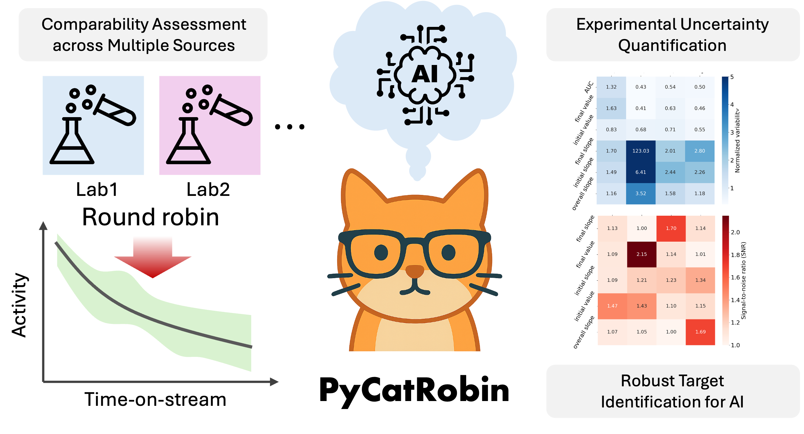

# PyCatRobin

<div align="center">

</div>

[](https://www.python.org/downloads/)
[](https://opensource.org/licenses/MIT)
[](https://pandas.pydata.org/)

**Py**thon module to analyze time-on-stream **Cat**alyst testing results from Round **Robin** test

## Getting started
### 1. Make a virtual environment (e.g., when using `conda`):
``` bash
conda create -n pycatrobin python=3.12
conda activate pycatrobin
```
### 2. Installation
* choice1) **Directly install using pip**
  ``` bash
  pip install git+https://github.com/dongjae-shin/PyCatRobin.git
  ```
* choice2) Clone repository & install using pip
  ``` bash
  git clone https://github.com/dongjae-shin/PyCatRobin.git
  cd PyCatRobin
  pip install .
  ```
  
### 3. Run the example code (under development)
* Example python codes to use PyCatRobin are in [`tutorial/`](https://github.com/dongjae-shin/PyCatRobin/tree/main/tutorial) directory.
* In the `tutorial/`, run as follows:
  ``` bash
  python ./example.py
  ```
  
## Acknowledgement
* Original codes for t-test and fANOVA analyses were written by Dr. Selin Bac (UCSB) and Michael Albrechtsen (DTU), respectively.