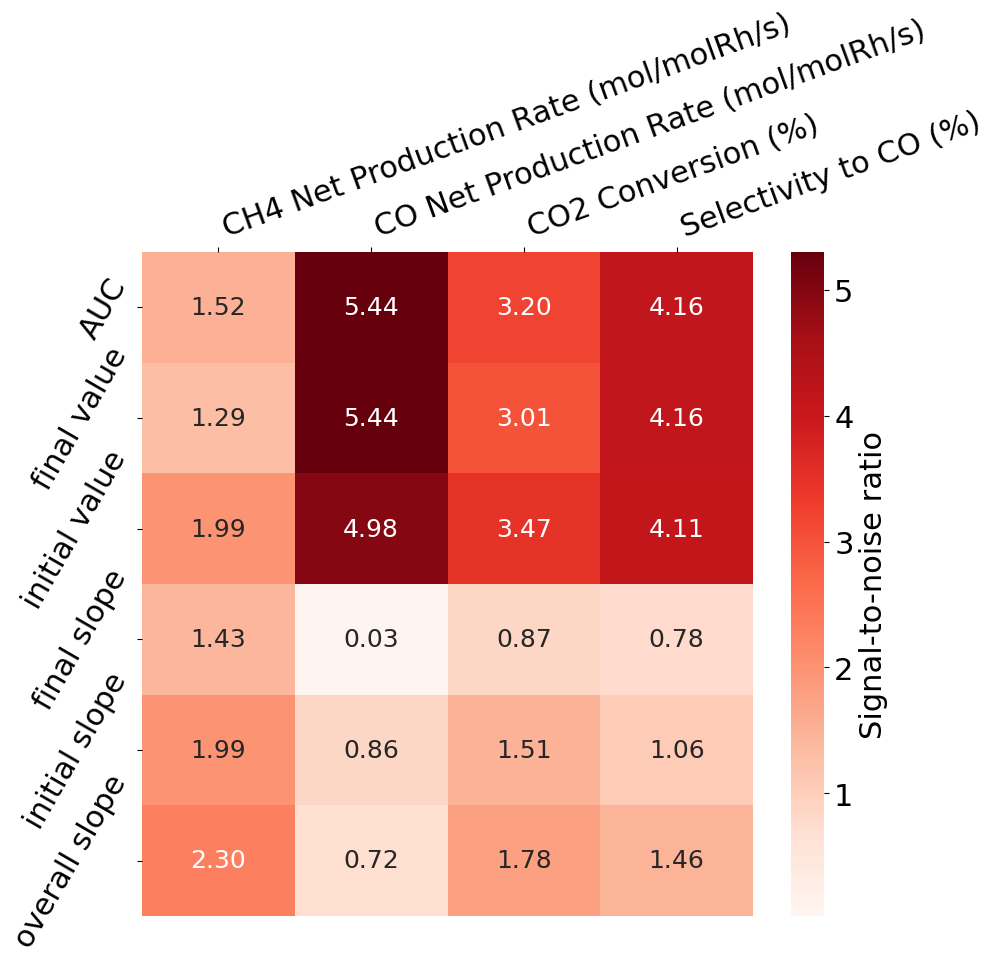

# PyCatRobin

<div align="center">

</div>

[](https://www.python.org/downloads/)
[](https://opensource.org/licenses/MIT)
[](https://pandas.pydata.org/)

**Py**thon module to analyze time-on-stream **Cat**alyst testing results from Round **Robin** test. Catalyst durability is an essential component to secure to realize industrial catalysts. A popular form of data that characterizes the durability is time-series data. When it comes to increasing dataset size by combining multiple data sources like reactors, we face challenges such as systematic errors between reactors and varying experimental conditions. `PyCatRobin` is developed to address these challenges by providing functionalities to extract features from time-series data, quantify uncertainties of them due to heterogeneity in reactors/conditions, and visualize the results effectively.

## Requirements
* All specified in `setup.py`

## Getting started
### 1. Make a virtual environment (e.g., when using `conda`):
``` bash
conda create -n pycatrobin python=3.12
conda activate pycatrobin
```
### 2. Installation
* choice1) **Directly install using pip**
  ``` bash
  pip install git+https://github.com/dongjae-shin/PyCatRobin.git
  ```
* choice2) Clone repository & install using pip
  ``` bash
  git clone https://github.com/dongjae-shin/PyCatRobin.git
  cd PyCatRobin
  pip install .
  ```
  
### 3. Run example codes (under development)
* Example python codes to use `pycatrobin` are in [`examples/`](examples/) directory.
* In the `examples/`, run python scripts as follows:
  ``` bash
  python ./Welchs_t_test_Fig_3.py
  python ./fANOVA.py
  ```
* Currently, Welch's t-test and fANOVA codes are separate scripts from `pycatrobin`. They will be incorporated into the main package in the near future.
* Run also Jupyter Notebooks such as `SNR_heatmap_Fig_3.ipynb`, `Feature_impact_Fig_S30.ipynb`, and `NV_heatmaps_Figs_S28-29.ipynb` as is in the following example:
  ``` python
  %matplotlib inline
  
  import pycatrobin.data.extract as ex
  import pycatrobin.analysis.data_analysis as da
  
  (...)
  
  # Specify the order of methods and properties to plot
  methods=[
      'AUC',
      'final value',
      'initial value',
      'final slope',
      'initial slope',
      'overall slope'
      ]
  
  properties=[
      'CH4 Net Production Rate (mol/molRh/s)',
      'CO Net Production Rate (mol/molRh/s)',
      'CO2 Conversion (%)',
      'Selectivity to CO (%)'
      ]
  
  # Plot heatmap of SNR values
  analysis.plot_heatmap(
      methods=methods,
      properties=properties,
      which_to_plot='snr', # std_dev, std_dev_mean_normalized
      snr_type='mu_sigma', # 'std_dev', 'range'
      cmap='Reds', # 'Blues'
      vmax=5.3,
      # vmin=0.0,
  )
  ```
  <div align="center">
    
  </div>

## Related publication
* Quantifying Experimental Uncertainty in Catalyst Deactivation: Round-Robin Testing and Implications for Machine-Learned Prediction*, 
S. Bac, D. Shin, S. Hong, J. Heinlein, A. Khan, G. Barber, Z. Chen, M. M. Albrechtsen, C. Tassone*, R. M. Rioux*, M. Cargnello*, S. R. Bare*, K. Winther*, P. Christopher*, A. S. Hoffman*, submitted (2025).

## Acknowledgement
* Original codes for t-test and fANOVA analyses were written by Dr. Selin Bac (UCSB) and Michael Albrechtsen (DTU), respectively.